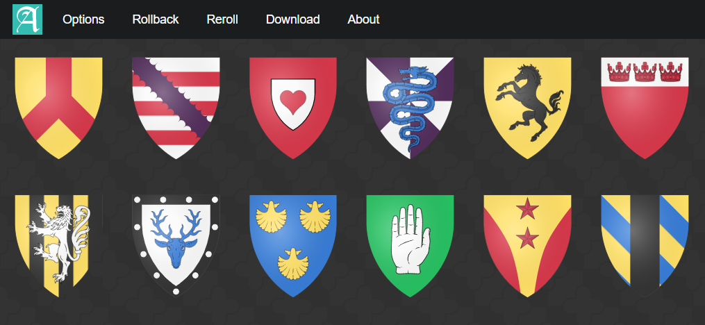
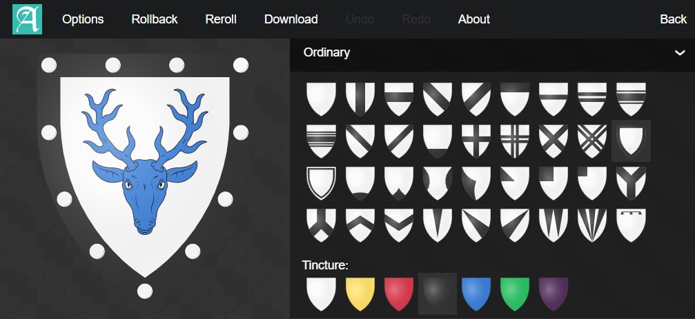

# Armoria

Armoria is a procedural heraldry generator and editor by Azgaar. It's both a serverless GUI tool and server-side API. Almost the same code is also used as a part of the [Fantasy Map Generator](https://github.com/Azgaar/Fantasy-Map-Generator) project.

The GUI version is available on [Github Pages](https://azgaar.github.io/Armoria/). Join our [Reddit community](https://www.reddit.com/r/FantasyMapGenerator) and [Discord server](https://discordapp.com/invite/X7E84HU) to share your creations, discuss the tool, suggest ideas and get the most recent updates.

You can support the project on [Patreon](https://www.patreon.com/azgaar).

A tutorial is available [on Wiki](https://github.com/Azgaar/Armoria/wiki/Armoria-Tutorial). In case you want to help with translation, join the project on [Crowdin](https://crowdin.com/project/armoria).





## For Developers

The tool is almost zero-dependency vanilla JS with just [Svelte](https://github.com/sveltejs/svelte) used for GUI. Svelte is a bit specific framework that compiles components to vanilla JS.

Pull requests are welcomed.

### Installation

Clone the repository and install the dependencies, then run `dev` to start Rollup and build in dev mode:

```
git clone https://github.com/Azgaar/Armoria.git
cd Armoria
npm install
npm run dev
```

Navigate to [localhost:5000](http://localhost:5000). You should see the app running. Edit a component file in `src`, save it, and reload the page to see your changes.

To create an optimised version run `npm run build`.

## API

Armoria API is available as a separate project, see [the documentation](https://github.com/Azgaar/armoria-api#readme). The API allows to `GET` random or predefined vector and raster heraldic images of a given size.

## Alternatives

While Armoria is focused on coat of arms generation and UI simplicity, there are some alternatives that cover heraldry more precisely.

[Heraldry.Digital](https://github.com/heraldry/armory) aims to support most of the heraldry features and create a system able to convert between blazonry and metadata. It allows users to create much more complex coats of arms, while it is not a generator and can be hard to use.

[DrawShield](https://github.com/drawshield/Drawshield-Code) is another wonderful project. It allows to render a coat of arms taking the heraldic blazon as input.

## License

The code is distributed under [MIT](https://opensource.org/licenses/MIT). Feel free to use it for any purpose.

Simple svg shapes and charges are self-made and available under [CC0](https://creativecommons.org/share-your-work/public-domain/cc0/). A lot of the complex charge renders are from [WappenWiki](http://wappenwiki.org) and available for [non-commercial use only](https://creativecommons.org/licenses/by-nc/3.0/). Check out the license details added to svg files and available on the _License_ screen on UI.

All images are manually optimized by me.
